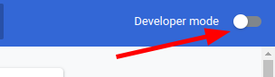
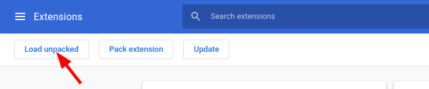
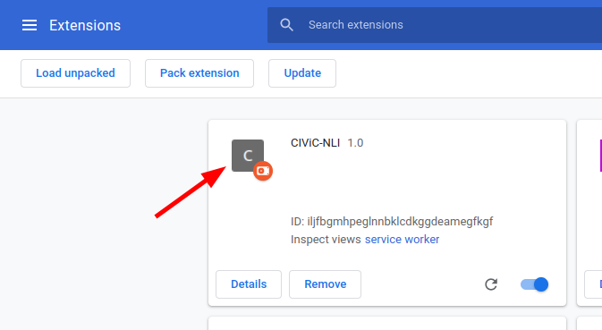
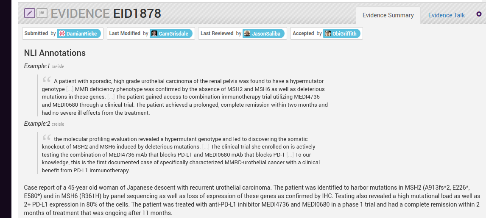
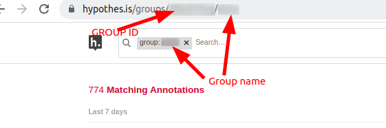
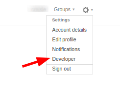
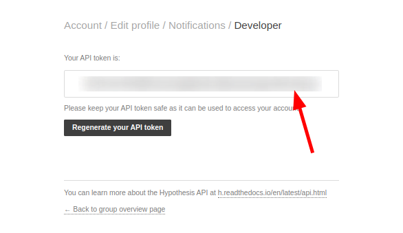

# CIViC NLI Chrome Extension

Chrome Extension for viewing Hypothes.is annotations in-line on CIViC Evidence Items for convenience of annotators.
This is a prototype only and does not store/add the group or API key for you, future iterations will involve a user form to add these.

- [Testing the Extension](#testing-the-extension)
- [Get the Hypothes.is Group ID](#get-the-hypothesis-group-id)
- [Get the Hypothes.is API Token](#get-the-hypothesis-api-token)

## Testing the Extension

Clone this repository

```bash
git clone https://github.com/creisle/civic-nli-ext.git
```

Open the `src/pass.js` file and replace the GROUP_ID and API_KEY fields with their expected content instead of the placeholders. Save this file.

Open the extensions page in chrome `chrome://extensions` and enable developer mode. This will allow you to load the extension



Next load the extension unpacked



Select the `src` folder of this repository. You should now see a new extension at the top of the page



Now, navigate to the evidence summary page of a CIViC Evidence Item with known annotations. The extension will now display the annotations on the page



## Get the Hypothes.is Group ID

You can find the relevant group ID by navigating to the group overview page in Hypothesis



## Get the Hypothes.is API Token

To find your API token, go to the developers page in Hypothes.is



Generate (or use existing if you have already generated it) and copy the API token


