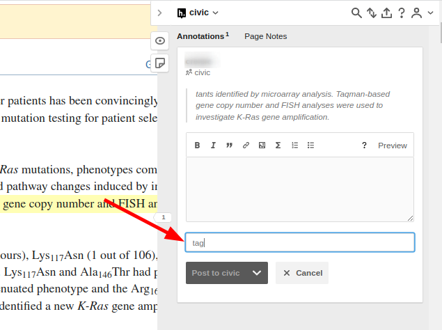
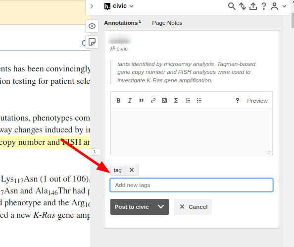

# FAQ

## Do I need to select everything?

You only need to select the minimum amount of text you, as a reviewer of the CIViC Entry would need to agree that this article supports the evidence Item. For example if there is a CIViC Evidence item which says "mutation M causes sensitivity to therapy T in disease D" and that sentence is paraphrased or repeated several times then you only need to select one of them. By convention we suggest choosing the first instance.

If you would like to select the different redundant sentences, this is in fact preferred! But it is a little more complicated. See the example [here](./examples/redundant.md)

## What if someone else already selected the text I need?

You can select over text that has already been annotated and create another annotation on top of it. Just ignore the existing annotation and proceed as you would if it were not there

## Hypothesis won't let me save unless I make a comment in the text box

To save an annotation in hypothesis you either need to add a comment or a tag. In our case we mostly only care about the tags. If you have added the tag but hypothesis still won't let you save, make sure that you have hit enter.

If your tag looks like below, it is still in the draft stage and you need to hit enter to submit/complete it

Once the tag has been completed you should be able to save/submit the annotation

## Can I add to another users annotation?

All annotations are processed unique to a single user. So if someone has already tagged a selected with some eid but you think it is missing some context (ex. the disease), then you need to re-annotate the original selection as well when you create your new annotations

## Can I annotate text outside of PMC/PubMed?

Yes, but if the same text is available in PMC or PubMed please annotate there instead.

## Can I annotate text to support the Evidence Statement?

In general the goal of this dataset is to select text annotations to be able to fact-check the core fields in a CIViC Evidence item: gene, variant, disease, drug, and clinical significance. However it is often helpful to the reviewer to have other content highlighted which supports the extra information that is capture by the free-text statement (or description). In those cases simply append the `-statement` element to your regular tag to indicate this content is extra to the core fields.

## Can I use the same annotation/selection for multiple evidence items?

Yes, you can simply add more than one tag to the same selection/annotation in hypothes.is. This will apply that selection to each of the evidence items separately.
