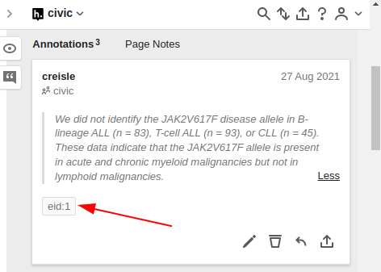

# Diagnostic

Diagnostic annotation examples must cover the core elements: gene, variant, clinical significance, and disease. Generally when looking to support diagnostic evidence items we are looking for text which indicates that the variant in question is specific to the given disease and can either act as a discriminator against other disease types or is characteristic/well-known in the disease.

## EID1

In [EID1](https://civicdb.org/evidence/1/summary) we are looking for text which indicates that the JAK V617F variant is **NOT** diagnostic of lymphoid leukemia.

First we must go to the [full text article online](https://www.ncbi.nlm.nih.gov/pmc/articles/PMC1895066). Then reading the paper we see the following text

> We did not identify the JAK2V617F disease allele in B-lineage ALL (n = 83), T-cell ALL (n = 93), or CLL (n = 45). These data indicate that the JAK2V617F allele is present in acute and chronic myeloid malignancies but not in lymphoid malignancies.

In the above text we have covered all the core elements

we then selected the text via hypothes.is and gave it the tag `eid:1`.

