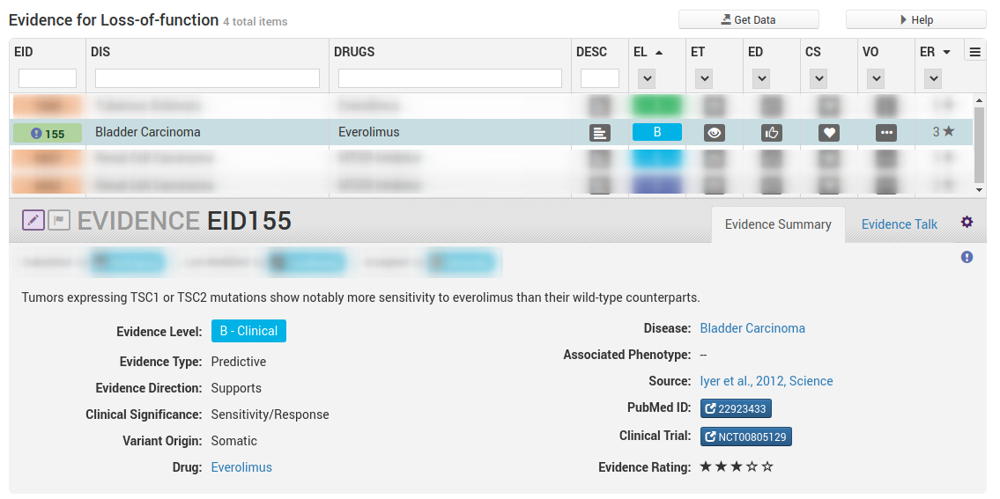
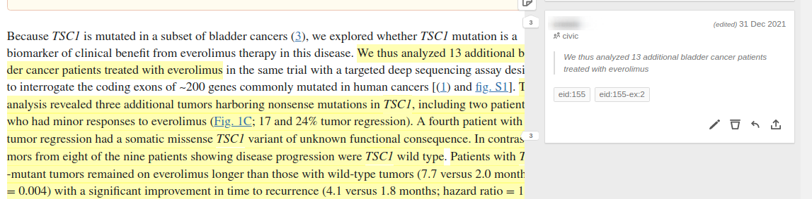

# EID155 Discontinuous Selections

Sometimes you may need to highlight multiple sections to support an evidence item and therefore you end up with multiple annotations for a single example tag. It is acceptable to re-use annotations between examples so long as they have one or more distinct annotations.

In the above example we are looking for statements/sentences which say that TSC1 LoF variants results in sensitivity to everolimus in bladder cancer.

Unlike the example above there is no single continuous highlight we can feasibly do to include all of these elements. Therefore the examples in this case will require multiple annotations. We start by looking for the annotation which describes the clinical significance as it is arguably the most important part.

We annotate the following two statements

> This analysis revealed three additional tumors harboring nonsense mutations in TSC1, including two patients who had minor responses to everolimus (Fig. 1C; 17 and 24% tumor regression). A fourth patient with 7% tumor regression had a somatic missense TSC1 variant of unknown functional consequence. In contrast, tumors from eight of the nine patients showing disease progression were TSC1 wild type.

> Patients with TSC1-mutant tumors remained on everolimus longer than those with wild-type tumors (7.7 versus 2.0 months, P= 0.004) with a significant improvement in time to recurrence (4.1 versus 1.8 months; hazard ratio = 18.5, 95% confidence interval 2.1 to 162, P = 0.001).

Both describe response to everolimus in TSC1-mutant tumours. Since these are sequential statements they could both be highlighted together, but since they are essentially redundant we have split them into two examples instead. The first one we tag `eid:155` (implicitly example 1) and the second one we tag `eid:155-ex:2`. However we are not yet finished, both examples are missing the disease context of "bladder cancer". We need to find a sentence which describes the disease the patient population being analyzed in this article had. We find a sentence just above these two annotations which does just that (by default for context annotations we pick the closest/first sentence that works).

> We thus analyzed 13 additional bladder cancer patients treated with everolimus

Since both of the examples need disease context we use both example tags on this annotation

