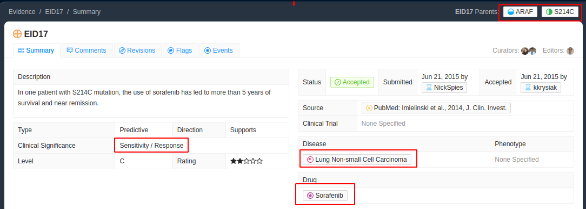
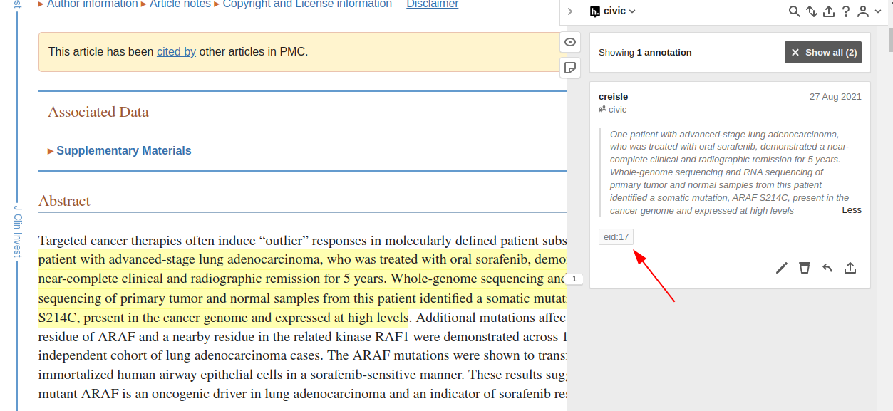
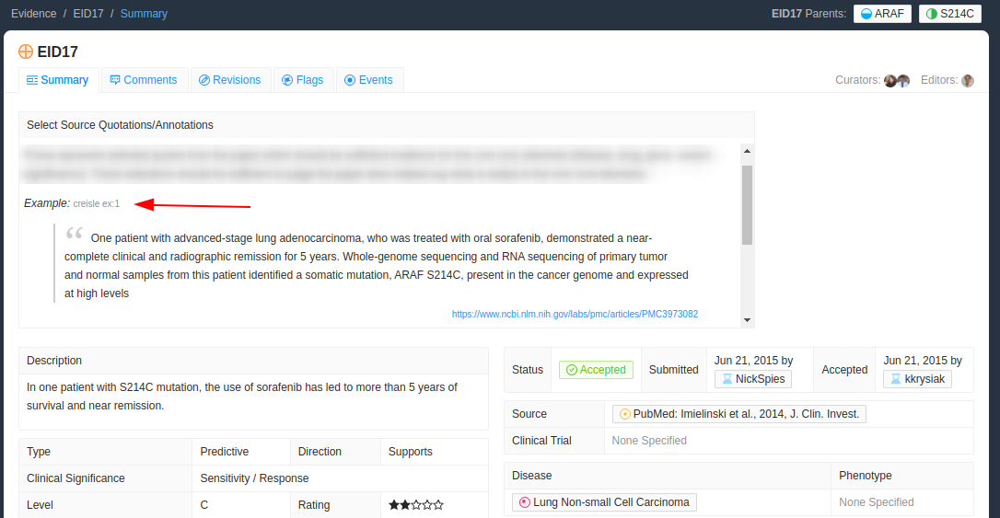

# EID17 Predictive Case Report

Predictive annotation examples must cover all of the core elements: gene, variant, clinical significance, drug, and disease. In the screenshot below, the red boxes represent the core elements which must be covered by our hypothes.is selection(s).

This one is fairly straightforward since we can highlight one consecutive span in the abstract which covers everything we need

> One patient with <mark>advanced-stage lung adenocarcinoma</mark>, who was treated with oral <mark>sorafenib</mark>, demonstrated a <mark>near-complete clinical and radiographic remission</mark> for 5 years. Whole-genome sequencing and RNA sequencing of primary tumor and normal samples from this patient identified a somatic mutation, <mark>ARAF S214C</mark>, present in the cancer genome and expressed at high levels.

So we select the above text in the article and give it the EID tag using hypothes.is

Now when we go back to the CIViC page for this evidence item, if we have the CIViC-NLI chrome extension installed, we should see our selection under examples

