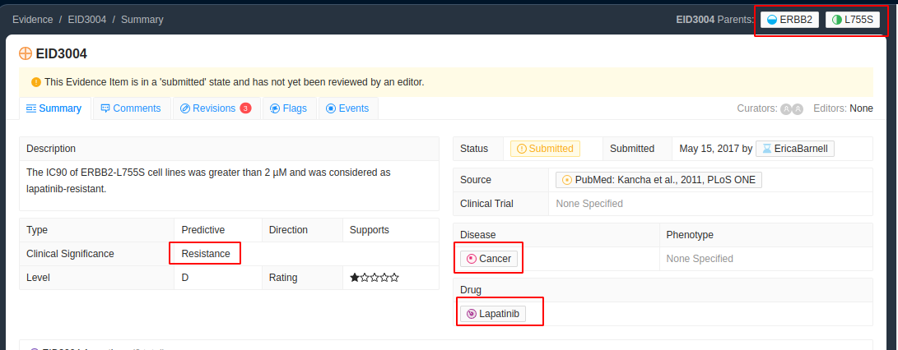
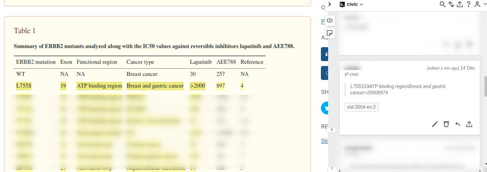

# EID3004 Redundancy

Sometimes there will be several different sentences that could be used to support a given evidence item. By default we pick the first or most suitable sentence but it is also possible (and preferred) to annotate all of them for completeness. We use a more complicated system of tagging here which adds an example section to the tag name `-ex:#`. This is so that we can tell which highlights are a sufficient.

Above we can see we are looking for the ERBB2 variant L755S and text which will indicate it causes resistance to lapatinib in cancer. "Cancer" is a special case in CIViC where it often means the disease model was non-specific. In such cases we do not worry about covering disease as one of our core selected elements.

Next we open up the article in PMC, if we can find text that is specifically referring to th variant of interest then that is preferred. The first instance we come across is in the Results and Discussion section. All of the following sentences could work as support.

**Sentence 1**

> In contrast, <mark>ERBB2-L755S</mark> (IC50>2 µM), ERBB2-L755P (IC50>1.5 µM) and ERBB2-T798M (IC50>1 µM) caused strong <mark>lapatinib resistance</mark> (Figure 4A and Table 1).

**Sentence 2**

> These results indicate that the amino acids <mark class="ns">L755</mark> and T798 in <mark>ERBB2</mark> are critical residues determining lapatinib sensitivity and those patients with these mutations may <mark>not respond</mark> to <mark>lapatinib</mark> treatment.

**Sentence 3**

>  In summary, based on lapatinib sensitivity, ERBB2 kinase domain mutations can be classified into three groups: (1) lapatinib-sensitizing (IC50≤30 nM) – ERBB2-H878Y & ERBB2-V777L; (2) lapatinib-sensitive (IC50 value between 30 nM and 1 µM) – ERBB2-V773A, ERBB2-N857S & ERBB2-T862A and (3) <mark>lapatinib-resistant</mark> (IC50>1 µM) – <mark>ERBB2-L755S</mark>, ERBB2-L755P & ERBB2-T798M.

If only annotating one line of support then the direction of which to pick is left up to the user. If you would like to annotate these as separate lines of support, then it is possible using the `ex:#` part of the tag. For example if we tag all three they would get the following tags:

- `eid:3004-ex:1` (or `eid:3004`, default example is 1)
- `eid:3004-ex:2`
- `eid:3004-ex:3`

Similarily if any of these sentences require context that can be tagged in the same way wit h `eid:3004-ex:#`

In particular sentence 2 mentions the L755 mutation but does not specify an alternate allele. Since the evidence item in CIViC is for L755S we would need additional information to fully verify the evidence item is supported. In this case I have chosed to tag the row in Table 1 which lists this as one of the mutations tested but it could have also been from the preceding sentence.

