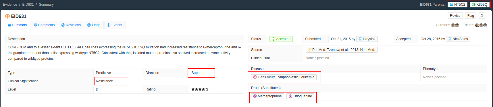
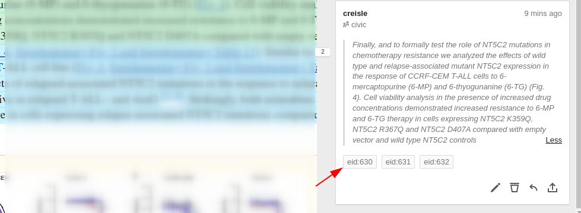

# EID630-632 Reusing Selections

Sometimes there will be a selection that will apply to multiple evidence items. For example, one sentence lists multiple variants or multiple drugs or multiple diseases. In those cases simply add multiple different tags to the same selection

When we navigate to the paper we find the following paragraph

> Finally, and to formally test the role of NT5C2 mutations in chemotherapy resistance we analyzed the effects of wild type and relapse-associated mutant NT5C2 expression in the response of <mark>CCRF-CEM T-ALL cells</mark> to 6-mercaptopurine (6-MP) and 6-thyogunanine (6-TG) (Fig. 4). Cell viability analysis in the presence of increased drug concentrations demonstrated <mark>increased resistance</mark> to <mark>6-MP</mark> and <mark>6-TG</mark> therapy in cells expressing <mark>NT5C2 K359Q</mark>, NT5C2 R367Q and NT5C2 D407A compared with empty vector and wild type NT5C2 controls.

However this same paragraph could be used as support for EID630 and EID632 as well.

> Finally, and to formally test the role of NT5C2 mutations in chemotherapy resistance we analyzed the effects of wild type and relapse-associated mutant NT5C2 expression in the response of <mark>CCRF-CEM T-ALL cells</mark> to 6-mercaptopurine (6-MP) and 6-thyogunanine (6-TG) (Fig. 4). Cell viability analysis in the presence of increased drug concentrations demonstrated <mark>increased resistance</mark> to <mark>6-MP</mark> and <mark>6-TG</mark> therapy in cells expressing <mark>NT5C2 K359Q</mark>, <mark>NT5C2 R367Q</mark> and <mark>NT5C2 D407A</mark> compared with empty vector and wild type NT5C2 controls.

Therefore when we tag the selection we give it all three EID tags

