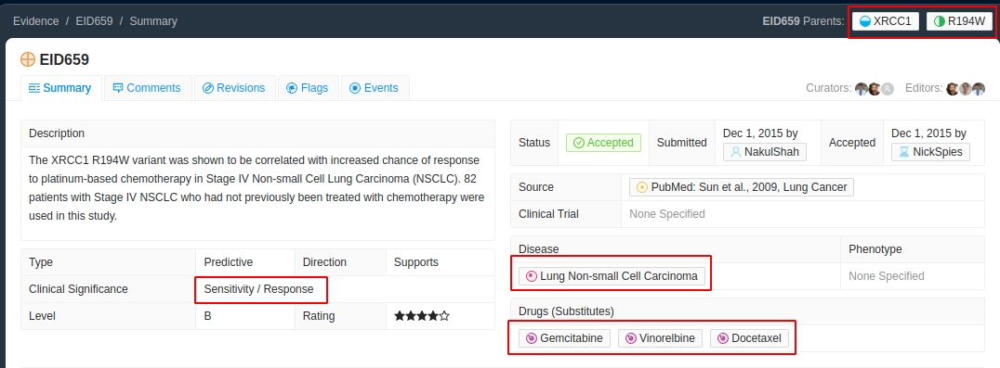
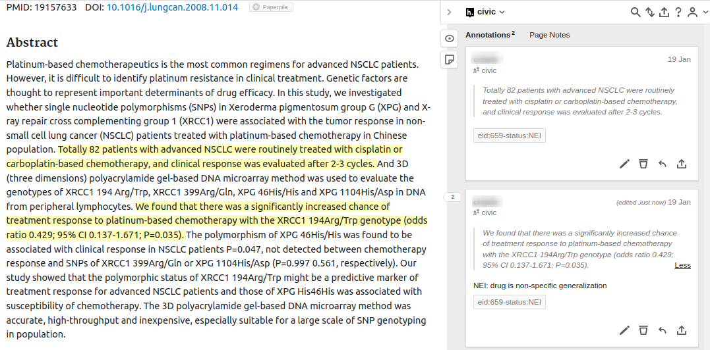

# EID659 Text is Non-Specific

This one is similar to the case we observed in the first example, however instead of the variant, this time the drug name used in the text is non-specific. This is not the same as if it were an alias. An equivalently specific but alternate name of a drug would be fine. However by using a less (or more) specific drug name they are making a broader implication that does not match the CIViC entry. These are a particularly nuanced case and it is important to mention the reason in the comments here being the drug is non-specific.

At the time of curation the full text was not available and we have therefore highlight/annotated the [pubmed abstract](https://pubmed.ncbi.nlm.nih.gov/19157633/) instead

For the evidence item [EID:659](https://civicdb.org/evidence/659) we expected a statement to mention Docetaxel, Gemcitabine, Vinorelbine as alternative but the abstract mentions the broader grouping of platinum-based chemotherapy

> We found that there was a <mark>significantly increased chance of treatment response</mark> to <mark class="ns">platinum-based chemotherapy</mark> with the <mark>XRCC1 194Arg/Trp</mark> genotype (odds ratio 0.429; 95% CI 0.137-1.671; P=0.035).

Therefore we add the NEI flag to the tag and also include a comment to say that the drug is non-specific

Notice that here we needed 2 disconnected spans to complete this example as neither span on its own contained the elements we expected. If only the second span was included we would not have the disease name.
