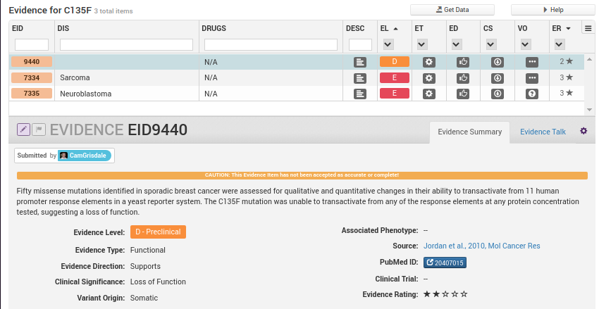
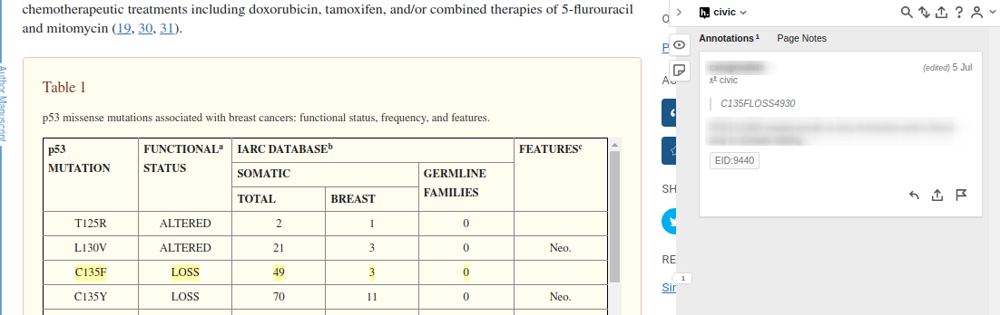

# EID9440 Selection Inside a Table

The following evidence item will be used as the running example for the instructions below: [EID:9440](https://civicdb.org/links/evidence/9440).

Above we can see that we are looking for supporting text which states that TP53:p.C135F is a loss-of-function variant. In this article there is only 1 place where the C135F variant is mentioned, table 1. This table also happens to have the functional characterization for the variant so selecting the row in this table should be sufficient support for someone reviewing the entry (since the header includes the gene name)

