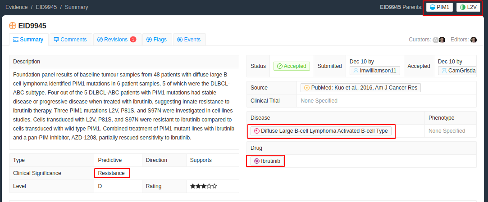
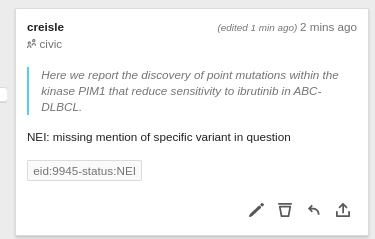

# EID9945 Abstract Only

The evidence item [EID:9945](https://civicdb.org/evidence/9945/summary) does not have the full text available in PMC (at time of annotation) and therefore we must select text from the [abstract in PubMed](https://pubmed.ncbi.nlm.nih.gov/27904766) instead.

> Here we report the discovery of <mark class="ns">point mutations</mark> within the kinase <mark>PIM1</mark> that <mark>reduce sensitivity</mark> to <mark>ibrutinib</mark> in <mark>ABC-DLBCL</mark>.

The variant we are looking for in this case in `PIM1:p.L2V` however that variant is not mentioned in the abstract at all as the variants are instead referenced as a group. This is still useful to select but we should add the NEI flag so that we know that the abstract text we select alone is not enough to check this CIViC entry is correct.

