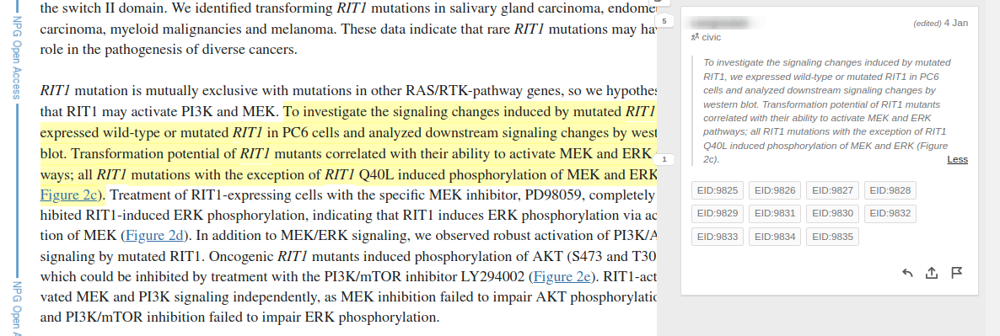

# Multiple Evidence Items in an Article

Often there will be more than one evidence item in a paper and the statements or sentences used for support will contain references to several of the variants. In these cases you can add multiple tags to the same annotation.

For example, the following annotation may serve as evidence for many different functional evidence items regarding the various mutations in RIT1

https://www.ncbi.nlm.nih.gov/labs/pmc/articles/PMC4150988/#annotations:tons0m2LEeyaAwNuvLeVTA

