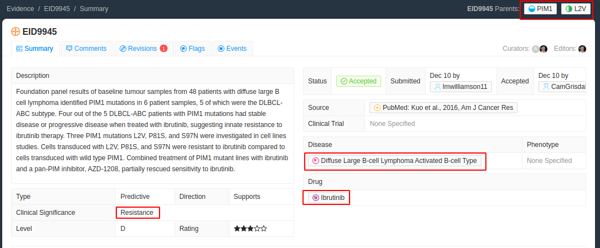

# Not Enough Information

Sometimes you will want to highlight text for an evidence item in CIViC where some of the relevant content is not accessible. There are a couple of ways this can come up

- The full text of the article is not in PMC and the specific text of interest is not in the abstract on PubMed
- The text is inside a figure and is not selectable
- The text is inside and image-style table and is not selectable
- The supporting evidence is not explicitly stated but rather only shown in images or supplementary information

In all of the above cases it is particularly useful if you add `-status:NEI` to your evidence ID tags. This will add a status of not enough information (NEI) to the tag and will ensure that when this data set is downloaded we know that the text selected alone is not sufficient to infer/support the CIViC Entry.

You should also add a comment to state why the content is insufficient.

## EID9945 Abstract Only

The evidence item [EID:9945](https://civicdb.org/evidence/9945/summary) does not have the full text available in PMC (at time of annotation) and therefore we must select text from the [abstract in PubMed](https://pubmed.ncbi.nlm.nih.gov/27904766) instead.

> Here we report the discovery of point mutations within the kinase PIM1 that reduce sensitivity to ibrutinib in ABC-DLBCL.

The variant we are looking for in this case in `PIM1:p.L2V` however that variant is not mentioned in the abstract at all as the variants are instead referenced as a group. This is still useful to select but we should add the NEI flag so that we know that the abstract text we select alone is not enough to check this CIViC entry is correct.

## EID659 Text is Non-Specific

This one is similar to the case we observed in the first example, however instead of the variant, this time the drug name used in the text is non-specific. This is not the same as if it were an alias. An equivalently specific but alternate name of a drug would be fine. However by using a less (or more) specific drug name they are making a broader implication that does not match the CIViC entry. These are a particularly nuanced case and it is important to mention the reason in the comments here being the drug is non-specific.

At the time of curation the full text was not avialable and we have therefore highlight/annotated the [pubmed abstract](https://pubmed.ncbi.nlm.nih.gov/19157633/) instead

For the evidence item [EID:659](https://civicdb.org/evidence/659) we expected a statement to mention Docetaxel, Gemcitabine, Vinorelbine as alternative but the abstract mentions the broader grouping of platinum-based chemotherapy

> We found that there was a significantly increased chance of treatment response to platinum-based chemotherapy with the XRCC1 194Arg/Trp genotype (odds ratio 0.429; 95% CI 0.137-1.671; P=0.035).

Therefore we add the NEI flag to the tag and also include a comment to say that the drug is non-specific

Notice that here we needed 2 disconnected spans to complete this example as neither span on its own contained the elements we expected. If only the second span was included we would not have the disease name.
