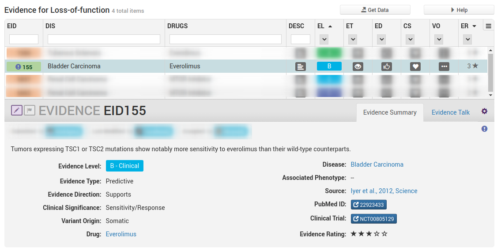

# Multiple Redundant Statements

Sometimes there will be several different sentences that could be used to support a given evidence item. By default we pick the first or most suitable sentence but it is also possible (and preferred) to annotate all of them for completeness. We use a more complicated system of tagging here which adds an example section to the tag name `-ex:#`. This is so that we can tell which highlights are a sufficient.

## Lapatinib Resistance Example

We will walk through this procedure with the following example [EID:3004](https://civicdb.org/links/evidence/3004)

Above we can see we are looking for the ERBB2 variant L755S and text which will indicate it causes resistance to lapatinib in breast cancer.

Next we open up the article in PMC, if we can find text that is specifically referring to th variant of interest then that is preffered. The first instance we come across is in the Results and Discussion section. All of the following sentences could work as support.

**Sentence 1**

> In contrast, ERBB2-L755S (IC50>2 µM), ERBB2-L755P (IC50>1.5 µM) and ERBB2-T798M (IC50>1 µM) caused strong lapatinib resistance (Figure 4A and Table 1).

**Sentence 2**

> These results indicate that the amino acids L755 and T798 in ERBB2 are critical residues determining lapatinib sensitivity and those patients with these mutations may not respond to lapatinib treatment.

**Sentence 3**

>  In summary, based on lapatinib sensitivity, ERBB2 kinase domain mutations can be classified into three groups: (1) lapatinib-sensitizing (IC50≤30 nM) – ERBB2-H878Y & ERBB2-V777L; (2) lapatinib-sensitive (IC50 value between 30 nM and 1 µM) – ERBB2-V773A, ERBB2-N857S & ERBB2-T862A and (3) lapatinib-resistant (IC50>1 µM) – ERBB2-L755S, ERBB2-L755P & ERBB2-T798M.

If only annotating one line of support then the disrection of which to pick is left up to the user. If you would like to annotate these as seperate lines of support, then it is possible using the `ex:#` part of the tag. For example if we tag all three they would get the following tags:

- `eid:3004-ex:1` (or `eid:3004`, default example is 1)
- `eid:3004-ex:2`
- `eid:3004-ex:3`

Similarily if any of these sentences require context that can be tagged in the same way wit h `eid:3004-ex:#`

In particular sentence 2 mentions the L755 mutation but does not specify an alternate allele. Since the evidence item in CIViC is for L755S we would need additional information to fully verify the evidence item is supported. In this case I have chosed to tag the row in Table 1 which lists this as one of the mutations tested but it could have also been from the preceding sentence.

## Overlapping Redundant Examples

Sometimes you may need to highlight multiple sections to support an evidence item and therefore you end up with multiple annotations for a single example tag. It is acceptable to re-use annotations between examples so long as they have one or more distinct annotations.

In the above example we are looking for statements/sentences which say that TSC1 LoF variants results in sensitivity to everolimus in bladder cancer.

Unlike the example above there is no single continuous highlight we can feasibly do to include all of these elements. Therefore the examples in this case will require multiple annotations. We start by looking for the annotation which describes the clinical significance as it is arguably the most important part.

We annotate the following two statements

> This analysis revealed three additional tumors harboring nonsense mutations in TSC1, including two patients who had minor responses to everolimus (Fig. 1C; 17 and 24% tumor regression). A fourth patient with 7% tumor regression had a somatic missense TSC1 variant of unknown functional consequence. In contrast, tumors from eight of the nine patients showing disease progression were TSC1 wild type.

> Patients with TSC1-mutant tumors remained on everolimus longer than those with wild-type tumors (7.7 versus 2.0 months, P= 0.004) with a significant improvement in time to recurrence (4.1 versus 1.8 months; hazard ratio = 18.5, 95% confidence interval 2.1 to 162, P = 0.001).

Both describe response to everolimus in TSC1-mutant tumours. Since these are sequential statements they could both be highlighted together, but since they are essentially redundant we have split them into two examples instead. The first one we tag `eid:155` (implicitly example 1) and the second one we tag `eid:155-ex:2`. However we are not yet finished, both examples are missing the disease context of "bladder cancer". We need to find a sentence which describes the disease the patient population being analyzed in this article had. We find a sentence just above these two annotations which does just that (by default for context annotations we pick the closest/first sentence that works).

> We thus analyzed 13 additional bladder cancer patients treated with everolimus

Since both of the examples need disease context we use both example tags on this annotation

