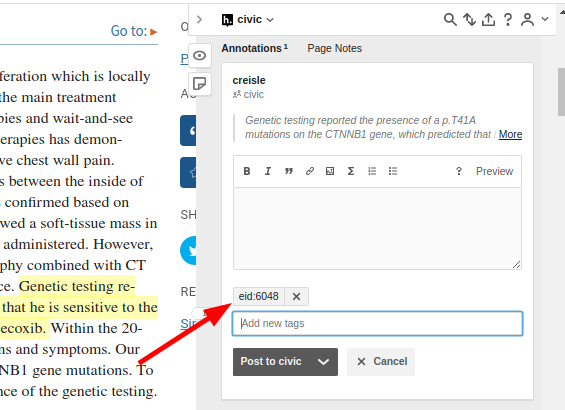

# Introduction

The aim of this project is to annotate relevant sections of the full-text of articles that are used to support evidence items in the Clinical Interpretation of Variants in Cancer database ([CIViC](https://civicdb.org/)). This will create a novel high-quality oncology-focused data set for natural language inference (NLI).

When selecting supporting sentences/text keep in mind that any given line of support for an evidence item should be minimal and sufficient. Pick the best support from the paper for that particular evidence item. The selected text in theory should be the only parts of the paper the civic reviewer would need to look at in order to review that the evidence item is indeed supported by that paper.

!!! Important

    Wherever possible annotations should be made on the PMC or PubMed websites instead of journal specific pages.

## Getting Started: Tutorial

The following instructions assume you already have some familiarity with CIViC. The first thing you will need is access to the private CIViC annotation group in Hypothes.is. Ask @creisle or another administrator for access.

Make sure that you have the hypothes.is chrome extension installed which should look something like this

For the following tutorial we are going to be going through evidence item [EID:6048](https://civicdb.org/links/evidence/6048)  which is derived from the following PMC article: [PMC5678687](https://www.ncbi.nlm.nih.gov/labs/pmc/articles/PMC5678687).

Now we are ready to start looking at the CIViC Entry.

### Evidence in CIViC

The Evidence item in CIViC looks like this

If we scroll up we can see that this evidence item is for the variant CTNNB1:p.T41A

So when we are reviewing the related PMC paper we will be looking for evidence which contains the following items of interest

- Gene
- Variant
- Clinical Significance
- Drug
- Disease

### Annnotating in PMC with Hypothes.is

When you open up the PMC article above you should click on the hypothes.is extension and make sure that you are annotating in the civic group

To start, we want to find a sentence or set of sentences which say that the patient was responsive or sensitive to Celecoxib. Select the text as you normally would and when the hypothes.is extension is active it will provide additional pop-up action buttons to the text selection

Click the annotate button which will bring up the side-bar application menu with the draft annotation

Before we can post/save the annotation we need to add a tag so that we know which CIViC Evidence Item this annotation is evidence for. Type "EID:6048" into the tags field and hit enter to create the tag.

Now you are ready to save, hit the "Post to civic" button to save the annotation. Once you have done this you should see the annotation on the right-hand side bar whenever you use the hypothes.is chrome extension and visit this page

In the above example we were able to use a single span to capture the significance of the statement. However, while this selection gives us the gene, drug, significance, and variant, it does not include the disease. Any selections we make to add details to an evidence item but do not include the main significance of the statement we call "context". To get the disease context for this evidence item we need to make an additional selection. For this example I have selected one additional span.

1. The sentence which identifies the disease in this patient

